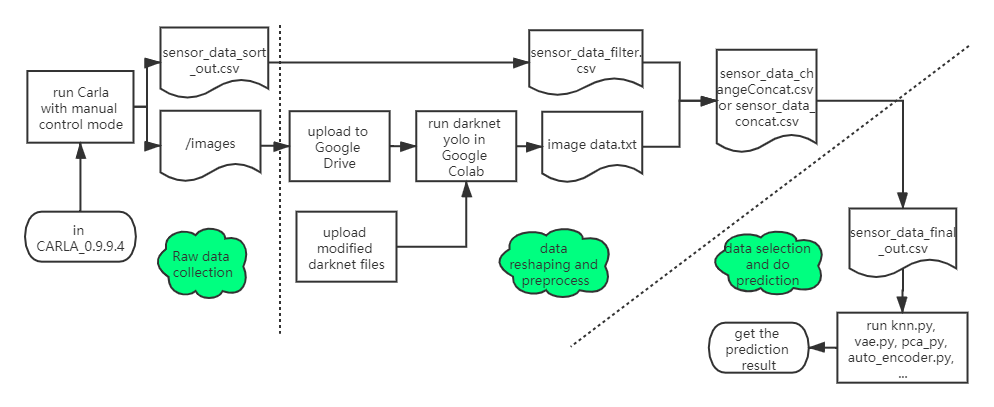
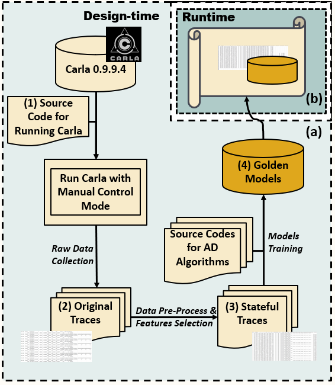

# Application-Level-Anomaly-Detection-in-Autonomous-Vehicle

This work is done in 2020  UCInspire program.

### introduction
Autonomous vehicle is one of the development directions in future society. One topic autonomous vehicle research should take great care of is the security. Accident should be completely avoided from happen on autonomous vehicles. To achieve this goal, an autonomous vehicle is supposed to be equipped with reliable anomaly detection mechanism. In general, to do the anomaly detection, an autonomous vehicle needs some related sensors to listen and collect real time sensor data. In addition, it needs one or some efficient algorithms to detect abnormal situation. In this project, I use Carla simulator to do the real time vehicle driving simulation, listening and collecting data from different kinds of sensors, and using outlier detection algorithms to detect abnormal situation.

### This is the whole experiment process:

### The final diagram is like this:

### The projects used are:
[Carla Simulator](https://github.com/carla-simulator/carla)
[Python Outlier Detection (PyOD)](https://github.com/yzhao062/pyod)
[Darknet Yolo v4](https://github.com/AlexeyAB/darknet)

